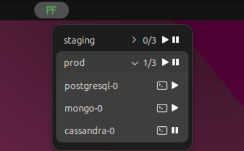

# GNOME Shell K8s Port Forwarder

Forward K8s ports from the GNOME Shell top bar.



## Installation

### From GitHub releases

1. Download the latest `.zip` from [Releases](https://github.com/ramikg/k8s-port-forwarder/releases).
2. Run:
    ```bash
    gnome-extensions install --force k8s-port-forwarder@ramikg.zip
    ```

_Requirements: GNOME 46+, `kubectl`_

### From source code

```bash
make install
```

_Additional requirement: Node.js_

### Post-installation

To enable the extension after installation:

1. Log out and back in (or reboot).
2. Run:
    ```bash
    gnome-extensions enable k8s-port-forwarder@ramikg
    ```

## Configuration

You can either configure the directories & port-forwarded resources from the UI (via the right-click menu),  
or by explicitly setting the entire configuration:

```bash
GSETTINGS_SCHEMA_DIR=~/.local/share/gnome-shell/extensions/k8s-port-forwarder@ramikg/schemas \
gsettings set org.gnome.shell.extensions.k8s-port-forwarder directories \
'[
  {
    "displayName": "staging",
    "context": "staging",
    "resources": [
      {"type": "service",  "name": "postgresql",  "namespace": "infra", "localPort": 5432,  "remotePort": 5432},
      {"type": "pod",      "name": "mongo-0",     "namespace": "infra", "localPort": 27017, "remotePort": 27017},
      {"type": "pod",      "name": "cassandra-0", "namespace": "infra", "localPort": 9042,  "remotePort": 9042}
    ]
  },
  {
    "displayName": "prod",
    "context": "prod",
    "resources": [
      {"type": "service", "name": "postgresql",  "namespace": "infra", "localPort": 5433,  "remotePort": 5432},
      {"type": "pod",     "name": "mongo-0",     "namespace": "infra", "localPort": 27018, "remotePort": 27017},
      {"type": "pod",     "name": "cassandra-0", "namespace": "infra", "localPort": 9043,  "remotePort": 9042}
    ]
  }
]'
```
